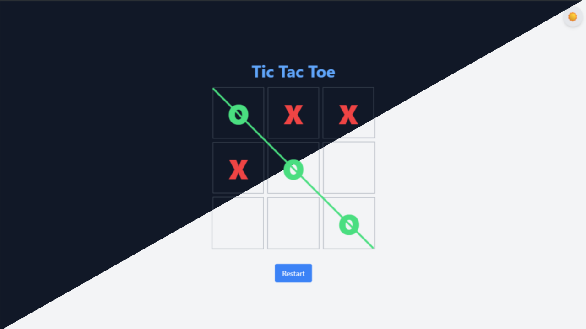

# Tic Tac Toe Game 🎮

A simple and fun Tic Tac Toe game built with **React** and **Vite**.

## 🧠 Features

- Classic 3x3 Tic Tac Toe board
- Player vs Player mode
- Game status updates (turns, winner, draw)
- Reset game functionality
- Responsive UI

## 🚀 Demo



You can try the live version here: *[Add your deployed link here]*

## 📦 Installation

To run the project locally:

```bash
git clone https://github.com/aziz-chniti/tic-tac-toe.git
cd tic-tac-toe
npm install
npm run dev 
```

## 📚 Tutorial

This project was explained in detail on YouTube step by step.  
👉 **Link:** [caming soon](https://www.youtube.com/@Barmajli)

## 📬 Contact

📧 Reach out on Instagram: [@Barmajli](https://www.instagram.com/barmajli)

Made with ❤️ by [Barmajli](https://www.youtube.com/@Barmajli)